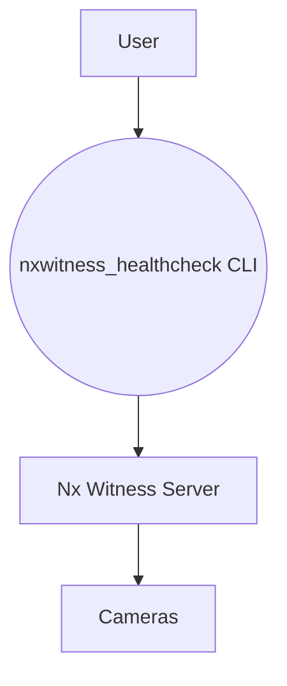

# tool-nxwitness-healthcheck

## What it is

CLI tool to perform health checks for the Nx Witness video management system, monitoring camera and server statuses.

## Why it exists

This project provides an easy way for IT and operations teams to automate periodic checks of Nx Witness servers and cameras, helping detect issues before they impact video monitoring. It wraps the Nx Witness REST API and presents results in a simple command line report.

## Architecture



The CLI uses the Nx Witness REST API to query server and camera status. The `nxwitness_healthcheck` Python package encapsulates API interactions.

For a more detailed diagram, see [docs/architecture.md](docs/architecture.md).

## Quickstart

1. Clone this repository and install dependencies:
   ```bash
   git clone https://github.com/C-Tech-Labs/tool-nxwitness-healthcheck.git
   cd tool-nxwitness-healthcheck
   pip install -e .
   ```

2. Run the CLI with your server details:
   ```bash
   python -m nxwitness_healthcheck.cli --server-url https://nx.example.com --username admin --password secret
   ```

## Usage examples

Run a health check against your Nx Witness server:

```bash
python -m nxwitness_healthcheck.cli \
  --server-url https://nx.example.com \
  --username admin \
  --password secret
```

Use a configuration file to store options:

```bash
python -m nxwitness_healthcheck.cli --config examples/config.yaml
```

## Roadmap

- Add support for additional health metrics (CPU, memory, disk usage).
- Integrate with notification channels (Slack, email).
- Provide packaged releases (Docker image, pip package) for easier deployment.

## Security notes

- **Never commit credentials** or other sensitive information to this repository.
- Use environment variables or secrets management to supply passwords and tokens.
