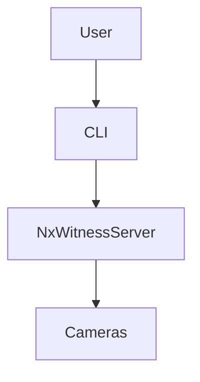

# Architecture

## Components

- **User**: Initiates the health check via the CLI.
- **CLI**: Python command-line interface that triggers health checks.
- **NxWitnessServer**: Nx Witness VMS server being monitored.
- **Cameras**: Connected camera devices managed by the VMS.

The CLI performs HTTP API calls to the Nx Witness server to gather health information about both the server and attached cameras, then summarizes the status for the operator.
